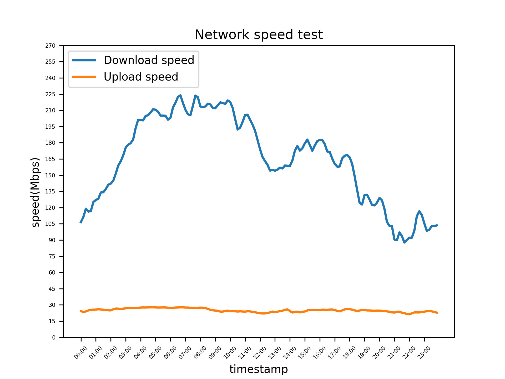

# speedtest_docker
run network speedtest every 10 minutes

# How to run docker container
1. make logs folder in root of your local repository
1. build docker image
	
  ```shell
  docker build --rm -t netspdtest .
  ```
3. run docker container

  Script below is written based on windows. 
  ```shell
  docker run -d --restart=always -v %cd%\logs:/logs \
	--name netspdtest netspdtest
  ```

# How to plot network speed

- install requirements.txt

  ```shell
  pip3 install -r requirements.txt
  ```
- run plot.py
  
  ```shell
  python3 plot.py
  ```